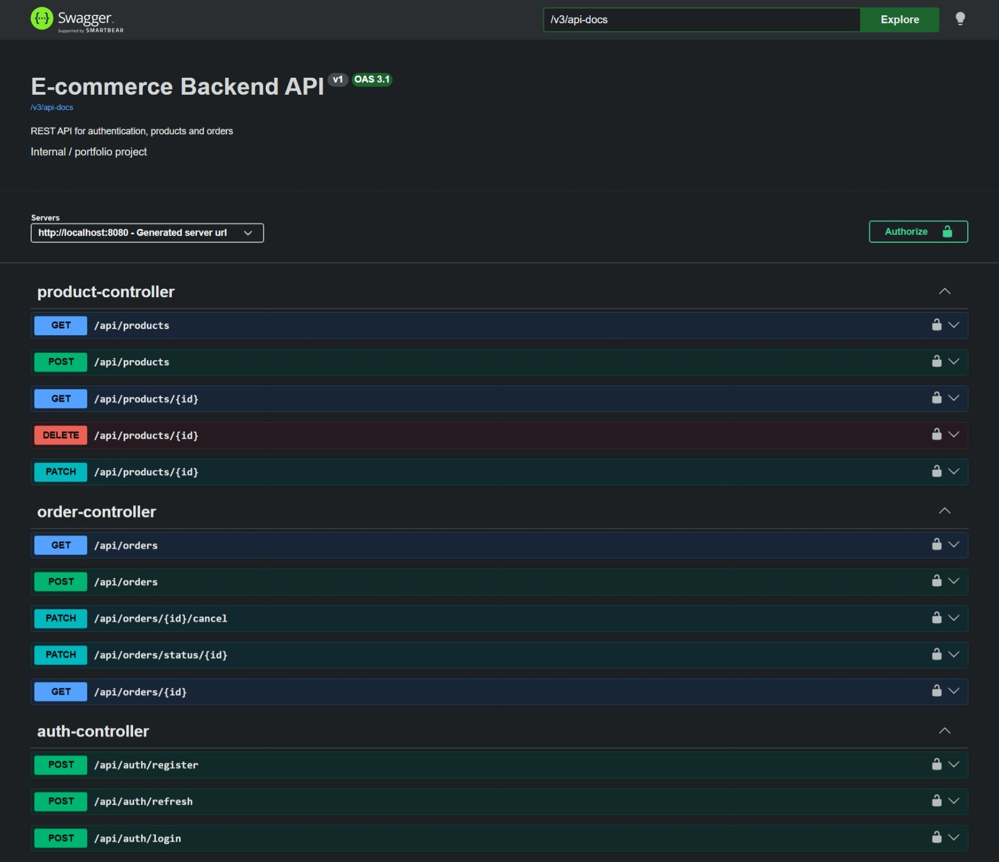
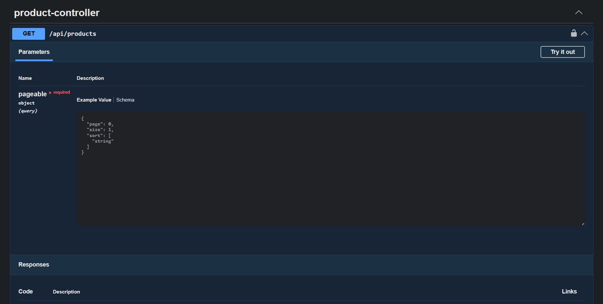
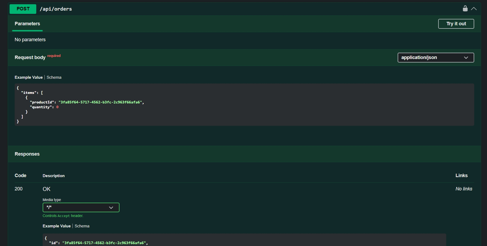

# E-commerce Backend API

[](https://github.com/Stellce/ecommerce/actions/workflows/backend-ci.yml)

Backend REST API for a small e-commerce application.

The project is built as a portfolio backend application and demonstrates a production-oriented Spring Boot setup: authentication, authorization, PostgreSQL persistence, Flyway migrations, DTO-based API layer, validation, integration tests, Docker Compose, and CI.

## Tech Stack

- Java 21
- Spring Boot
- Spring Security
- JWT authentication
- Spring Data JPA
- PostgreSQL
- Flyway
- Gradle
- Docker / Docker Compose
- Testcontainers
- JUnit 5
- OpenAPI / Swagger UI
- GitHub Actions CI

## Main Features

- User registration and login
- JWT access and refresh tokens
- Role-based authorization
- Product management
- Order creation and order status updates
- DTO validation
- Global exception handling
- JSON responses for authentication and authorization errors
- Database migrations with Flyway
- Integration tests with PostgreSQL Testcontainers
- Docker Compose setup for local development

## API documentation screenshots

The API is documented with Swagger / OpenAPI and includes the main e-commerce modules such as authentication, product management and order processing.



Example product endpoint with filtering, pagination and response schema:



Example order endpoint for the e-commerce order flow:




## Project Structure

```text
.
├── backend
│   ├── src/main/java/com/example/backend
│   │   ├── auth
│   │   ├── bootstrap
│   │   ├── common
│   │   ├── config
│   │   ├── order
│   │   ├── product
│   │   ├── security
│   │   └── user
│   ├── src/main/resources/db/migration
│   └── src/test/java/com/example/backend
│       ├── integration
│       ├── testsupport
│       └── unit
├── docs
│   ├── api
│   ├── architecture.md
│   └── database.dbml
├── docker-compose.yml
└── README.md
```

## Environment Variables

Create `.env` in the project root:

```env
POSTGRES_DB=shop
POSTGRES_USER=shop
POSTGRES_PASSWORD=shop

JWT_SECRET=replace-with-base64-256-bit-secret
JWT_ACCESS_EXPIRATION=10m
JWT_REFRESH_EXPIRATION=7d

BOOTSTRAP_ADMIN_EMAIL=admin@example.com
BOOTSTRAP_ADMIN_PASSWORD=admin123
```

Generate a JWT secret:

```bash
openssl rand -base64 32
```

## Running with Docker Compose

From the project root:

```bash
docker compose up --build
```

The application will be available at:

```text
http://localhost:8080
```

PostgreSQL will be available at:

```text
localhost:5432
```

Default database configuration:

```text
database: shop
user: shop
password: shop
```

## Running Locally Without Docker

Start PostgreSQL manually or through Docker:

```bash
docker compose up db
```

Then run the backend:

```bash
cd backend
./gradlew bootRun
```

On Windows:

```bash
cd backend
gradlew.bat bootRun
```

## API Documentation

Swagger UI is available after the application starts:

```text
http://localhost:8080/swagger-ui/index.html
```

OpenAPI JSON:

```text
http://localhost:8080/v3/api-docs
```

Additional API documentation is available in:

```text
docs/api/endpoints.md
docs/api/common-dtos.md
```

## Database Migrations

Flyway migrations are stored in:

```text
backend/src/main/resources/db/migration
```

Current migration:

```text
V1__init.sql
```

Flyway runs migrations on application startup.

## Tests

Run all tests:

```bash
cd backend
./gradlew test
```

The project contains integration tests for API/database/security flows, including:

- AuthControllerIT
- ProductControllerIT
- OrderControllerIT

Covered scenarios include registration, login, JWT-protected endpoints, invalid/tampered JWT handling, role-based access, product management and order flows.
Integration tests use Testcontainers with PostgreSQL.

## CI

The project includes automated tests and a GitHub Actions workflow for checking the application on repository changes.


GitHub Actions runs backend tests on push and pull request.

Workflow file:

```text
.github/workflows/backend-ci.yml
```

## Useful Commands

Build the backend:

```bash
cd backend
./gradlew build
```

Run tests:

```bash
cd backend
./gradlew test
```

Build Docker image through Compose:

```bash
docker compose build backend
```

Start the full stack:

```bash
docker compose up --build
```

Stop containers:

```bash
docker compose down
```

Remove containers and database volume:

```bash
docker compose down -v
```

## API Overview

Main resource groups:

- Auth API
- Product API
- Order API

Typical auth flow:

1. Register user
2. Login
3. Use access token as Bearer token
4. Refresh token when access token expires

Example Authorization header:

```text
Authorization: Bearer <access-token>
```

## Example Requests

Register a user:

```bash
curl -X POST http://localhost:8080/api/auth/register \
  -H "Content-Type: application/json" \
  -d '{
    "email": "user@example.com",
    "password": "password123"
  }'
```

Login:

```bash
  curl -X POST http://localhost:8080/api/auth/login \
  -H "Content-Type: application/json" \
  -d '{
    "email": "user@example.com",
    "password": "password123"
  }'
```

Create a product as admin:

```bash
curl -X POST http://localhost:8080/api/products \
  -H "Authorization: Bearer <admin-access-token>" \
  -H "Content-Type: application/json" \
  -d '{
    "name": "Keyboard",
    "description": "Mechanical keyboard",
    "price": 199.99,
    "stock": 10
  }'
```

Create an order:

```bash
curl -X POST http://localhost:8080/api/orders \
  -H "Authorization: Bearer <user-access-token>" \
  -H "Content-Type: application/json" \
  -d '{
    "items": [
      {
        "productId": "<product-id>",
        "quantity": 2
      }
    ]
  }'
```

## Documentation

Architecture notes:

```text
docs/architecture.md
```

Database model:

```text
docs/database.dbml
```

API endpoints:

```text
docs/api/endpoints.md
```

Common DTOs:

```text
docs/api/common-dtos.md
```

## What This Project Demonstrates

- Building REST APIs with Spring Boot
- Separating controllers, services, repositories, DTOs, and mappers
- Secure authentication with JWT
- Role-based access control with Spring Security
- PostgreSQL persistence with JPA
- Schema versioning with Flyway
- Integration testing with Testcontainers
- Dockerized local development
- CI with GitHub Actions
- Clear project documentation
- Security-focused integration testing for JWT and protected endpoints
- Clean test isolation with PostgreSQL Testcontainers
